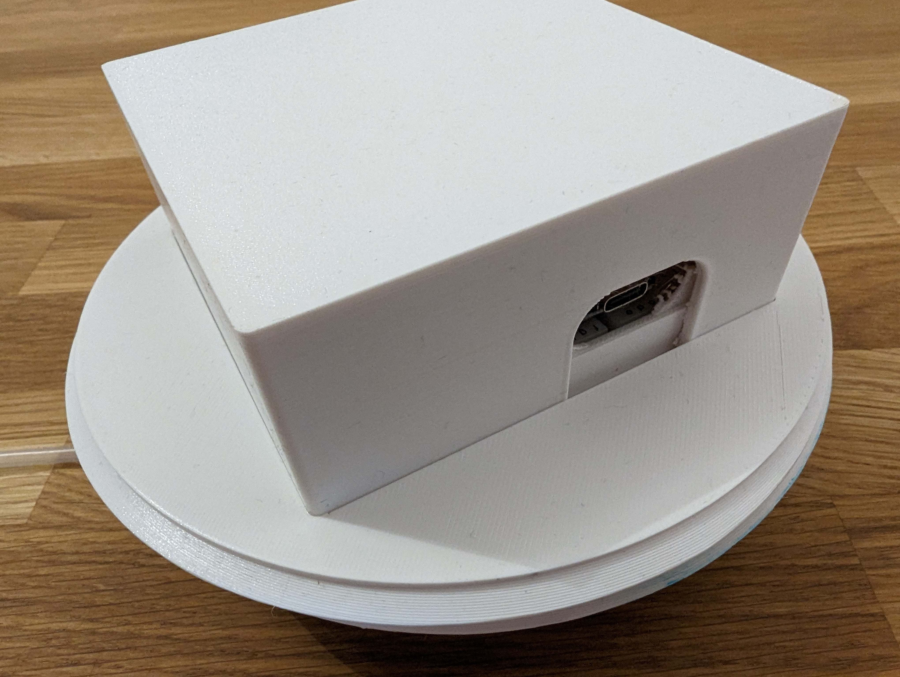

import Code from '../../snippets/AeroTowerControllerCode.mdx'

# AeroTower Electronics

The circuit of the tower is based on ordinary breadboards to be easily extendable and accessible.

## List of Components

- [Breadboard (55x83 mm)](https://www.ebay.de/itm/185053021698?mkcid=16&mkevt=1&mkrid=707-127634-2357-0&ssspo=p795EKDWQse&sssrc=2047675&ssuid=&widget_ver=artemis&media=COPY)
- [Seeed XIAO Samd21](https://www.berrybase.de/seeeduino-xiao-arduino-microcontroller-samd21-cortex-m0)
- [Seeed Water Atomizer](https://www.berrybase.de/seeed-grove-modul-fuer-vernebelung-von-wasser)
- [M20 Mini Water Pump](https://www.ebay.de/itm/125334850334)
- [Mosfet (IRFZ44N)](https://www.reichelt.de/mosfet-n-kanal-55-v-49-a-rds-on-0-0175-ohm-to-220ab-irfz-44n-p8820.html)
- [10k Ohm Resistor](https://www.reichelt.de/widerstand-metallschicht-10-0-kohm-0207-0-6-w-1--metall-10-0k-p11449.html)
- [Diode](https://www.reichelt.de/gleichrichterdiode-1000-v-1-a-do-41-1n-4007-dio-p219368.html)
- [Jumper Wires](https://amzn.eu/d/h0FLA8S)
- [Cotton Sticks](https://amzn.eu/d/0gSTmLu)
- [3x4 mm silicone tube](https://www.ebay.de/itm/263190368164), length depending on your towers height

## Assembly

### Seeed XIAO

### Connect the Pump

### Add the Atomizer

## Code

First, you need to [install CicuitPython onto the Seeed XIAO](https://wiki.seeedstudio.com/Seeeduino-XIAO-CircuitPython/).

Afterwards, create a file named `code.py` in the root folder of the device and add the following code:

<Code />

## Mounting Everything into the tower
