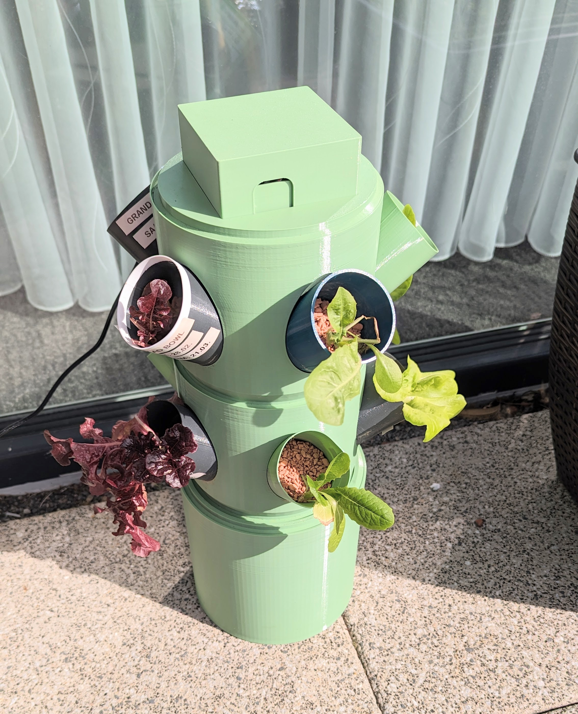

import Link from "next/link";
import VerticalFarming from "../../snippets/VerticalFarming.mdx";
import { ModelViewer } from "../../components/ModelViewer";
import { AeroTowerDiscordWidget, aerotower_comments } from "../../components/AeroTowerDiscordWidget";

# AeroTower

When searching for an inexpensive aeroponics system, which was also scalable and modifiable, not many options were found. That is how this project came to life.

The AeroTower is designed to serve as an easy entry into the world of aeroponics. You can start at **low cost**, **modify** everything as you build it and finally **scale** the system up, if you want to.

In its final form, the AeroTower should be completly **open source** (model, electronics, firmware), **self-sufficient** in terms of energy through a solar panel and connected like an IoT device.

Below, you can see a picture of the printed tower:

## Vertical Farming

<VerticalFarming />

The AeroTower is designed to make this concept more tangible while also allowing for scaling the system up to a complete farm, which can be operated indoor or outdoor.

## The Model

The model itself is inspired by archipelagourbanfarms' [Modular Hydroponic System](https://www.thingiverse.com/thing:2403922) but designed from the ground up. A 3d printable water tank is added, the parts can be screwed together and everything is printable on machines as small as the [Prusa Mini](https://www.prusa3d.com/category/original-prusa-mini/). You can view the source files [here](https://github.com/urban-smart-grow/AeroTower/tree/master/src) or edit them. For editing, it is recommended to first take a look at [Cadquery 2](https://cadquery.readthedocs.io/en/latest/index.html), which is used here.

For print instructions and previews, head over to the [models page](./aerotower/models).

## Electronics

To build the electronics of the AeroTower, [please have a look here](aerotower/electronics).
For the moment, the circuitry needs to be powered by an external power source. To become fully self sufficient, power supply by battery and solar is planned.

## Grow Media

Any kind of grow media will work, but the one tested so far is [Seramis](https://www.seramis.com/), a fine clay granulate.
It prevents the fog from spilling out of the cups.

## Nutrient Solution

To cultivate your crops with aeroponics (or hydroponics), you will need a special fertilizer to replace the nutrients which would be provided by the soil.

One product which is recommended [elsewhere](https://www.nosoilsolutions.com/mix-three-part-nutrient-solution) can be found [here](https://www.amazon.com/General-Hydroponics-Flora-Bloom-Fertilizer/dp/B01I4U0M32).

At the moment, only [this product](https://bionovanutrients.com/Bionova-Aero-Supermix/50041Z) is tested with the AeroTower.

Different types of salad were grown indoors under artificial lighting with a nutrient solution mixed according to manufacturer specifications.
While the plants did grow, the success was mediocre, which can also be related to the lighting not being powerful enough.
The test will be repeated under sunlight soon.

## Lighting

By intention, lighting is not part of the AeroTower. The tower is designed to supply plants with water and nutrients while being powered by light itself.

If you plan to use the tower indoors with artificial lighting, you can follow [this link](https://lightsciencetech.com/what-are-par-ppf-and-ppfd-and-why-should-you-care/) to learn about metrics for grow lights.

To find the right light system for you, a good start could be to search for lights using the LM301B, [an energy efficient LED from Samsung](https://hackaday.com/2022/10/31/a-single-watt-hydroponic-lighting-system/) which could also be bought [here](https://www.led-tech.de/de/21x-Samsung-LM301B-Streifenplatine-3500k).

## Comments

<AeroTowerDiscordWidget channel={aerotower_comments} />
