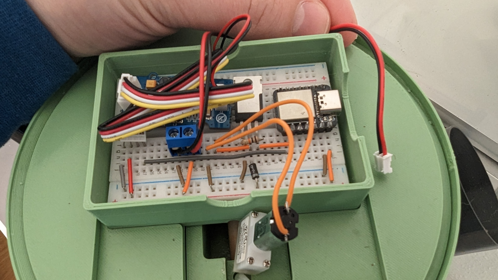
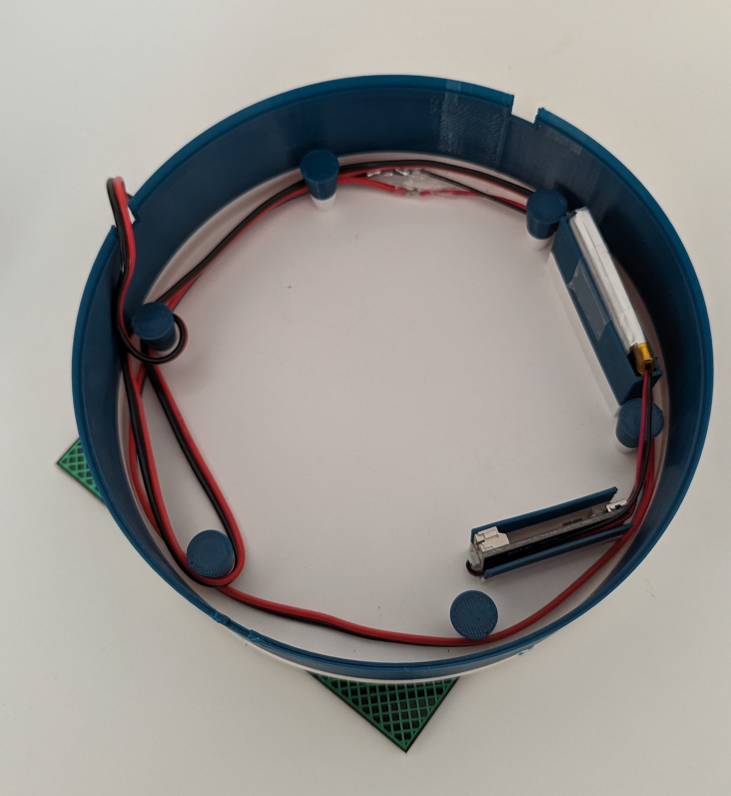

import {
  ModelViewer,
  defaultPrintInstructions,
} from '../../components/ModelViewer'
import {
  AeroTowerDiscordWidget,
  solar_module,
} from '../../components/AeroTowerDiscordWidget'

# Solar Module

You can upgrade your AeroTower by adding a solar module like described below.
The module houses a battery, solarcell and charger board.
It also protects the tower electronics even from heavy rain.

## Parts

- [Charger, Solarcell](https://de.aliexpress.com/item/1005005301675105.html?spm=a2g0o.order_list.order_list_main.5.21ef5c5fps9Fd4&gatewayAdapt=glo2deu)
- [Battery](https://amzn.eu/d/gnIZaRv)
- [Cable with JST connector](https://amzn.eu/d/5wLnmaz)
- [Cable Clamp](https://www.ebay.de/itm/124103646666)
- Model (see below)

<ModelViewer
  showDownloadLink
  url='https://raw.githubusercontent.com/urban-smart-grow/AeroTower/main/exports/solar_module_case.stl'
  printInstructions={defaultPrintInstructions}
/>

## Instructions

1. connect the cable and the clamp

1. plug the clamp pins into the bread boards powerlane.
   

1. mount the battery and the charger board into the case.
   Mount the solar cell on the outside of the case.
   You can lock everything in place by using duct tape.
   

You can optionally charge the battery by usb.
Next, connect the jst connector to the charger board on the 'sys out' port.
Finally you can put the solar module on top of the tower and organize the cables
using the hooks and cutouts on the solar_module_case.

## Comments

<AeroTowerDiscordWidget channel={solar_module} />
